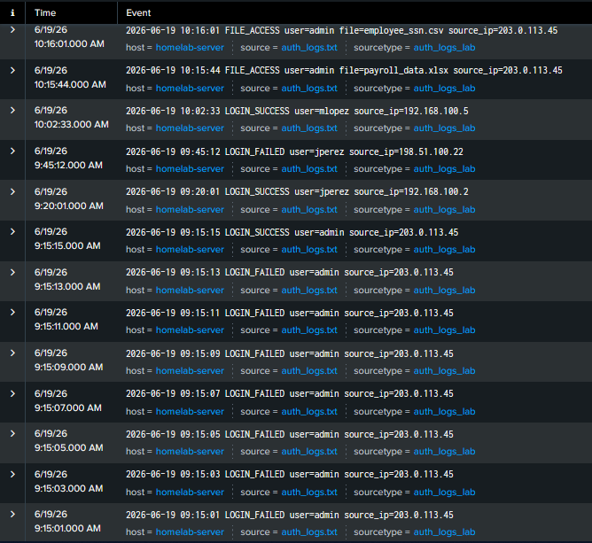
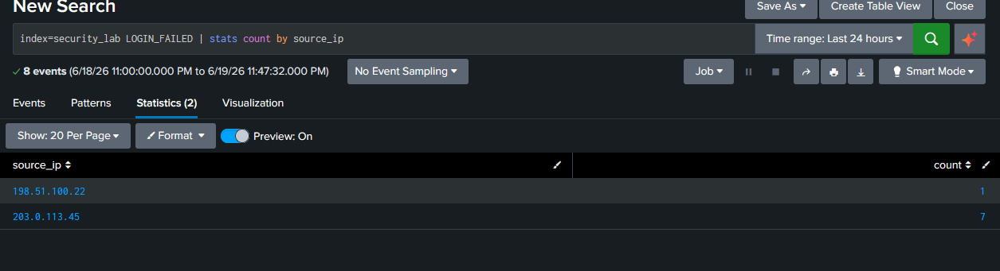
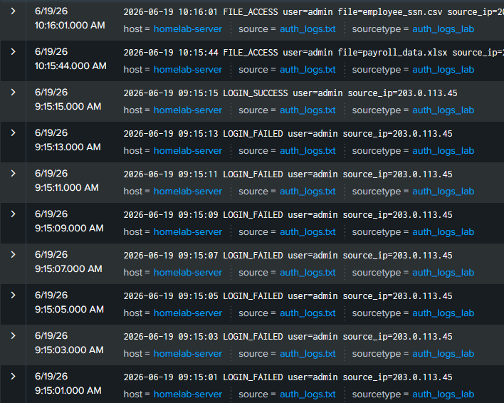
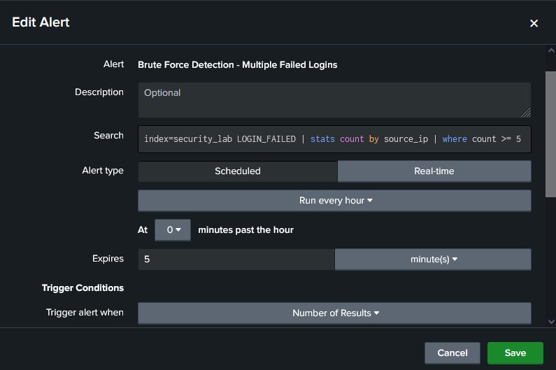

# Lab 04 — SIEM Basics with Splunk: Brute Force Detection

## Objective
Build a basic SIEM (Security Information and Event Management) workflow
using Splunk: ingest authentication logs, detect a brute force attack
pattern using SPL (Search Processing Language), and configure an
automated alert for future detection.

## Tools Used
- Splunk Enterprise (Free Trial) — Windows 10
- Sample authentication log file (custom-built)

## Scenario
A simulated authentication log was created to mimic a real-world brute
force attack followed by successful access and sensitive file retrieval —
a common attack chain seen in SOC environments.

## Steps Performed
1. Created a sample log file (`auth_logs.txt`) simulating authentication
   events: failed logins, successful logins, and file access events
2. Uploaded the log file to Splunk via Add Data → Upload
3. Configured source type, host, and created a custom index (`security_lab`)
4. Verified Splunk correctly parsed each line as a separate timestamped event
5. Ran SPL searches to identify anomalous login behavior
6. Investigated the full activity timeline of the suspicious IP
7. Created a scheduled alert to automatically flag brute force patterns

## SPL Queries Used

**View all ingested logs:**
index=security_lab

**Count failed login attempts grouped by source IP:**
index=security_lab LOGIN_FAILED | stats count by source_ip

**Investigate full activity timeline for the suspicious IP:**
index=security_lab source_ip="203.0.113.45"

**Detection query (used in the alert) — flag IPs with 5+ failed logins:**
index=security_lab LOGIN_FAILED | stats count by source_ip | where count >= 5

## Key Findings

| IP Address | Failed Logins | Outcome |
|---|---|---|
| 203.0.113.45 | 7 | Login succeeded after 7 failed attempts |
| 198.51.100.22 | 1 | Single failed attempt — not flagged |

**Attack timeline for 203.0.113.45:**
09:15:01 → 09:15:13   7x LOGIN_FAILED (user=admin)

09:15:15               LOGIN_SUCCESS (user=admin)

10:15:44               FILE_ACCESS — payroll_data.xlsx

10:16:01               FILE_ACCESS — employee_ssn.csv

This is a classic brute force → successful compromise → data access
pattern, including access to sensitive files (PII, payroll data) shortly
after the successful login.

## Screenshots

## Alert Configuration
- **Name:** Brute Force Detection - Multiple Failed Logins
- **Type:** Scheduled — runs hourly
- **Trigger Condition:** Number of Results > 0
- **Action:** Add to Triggered Alerts
- **Detection threshold:** 5 or more failed logins from the same source IP

## Security Relevance
In a SOC analyst role, this exact workflow is performed daily:
- **Log aggregation** — centralizing authentication events from multiple sources
- **Pattern detection** — using `stats` and `where` to surface anomalies
- **Threshold-based alerting** — automating detection instead of manual review
- **Incident timeline reconstruction** — tracing an attacker's full activity

This scenario reflects a real **brute force attack** technique
(MITRE ATT&CK T1110) followed by potential **data exfiltration** —
a high-severity finding that would trigger immediate incident response
in a production environment.

## Mitigation Recommendations
- Implement **account lockout policies** after a defined number of
  failed attempts
- Enable **MFA (Multi-Factor Authentication)** to reduce impact of
  credential-based attacks
- Monitor for **impossible travel** or unusual access times
- Apply **rate limiting** on authentication endpoints
- Alert on **file access to sensitive data** immediately following
  unusual login activity

## Lessons Learned
- SPL's `stats` and `where` commands turn raw logs into actionable
  detections in seconds
- Splunk indexes allow logical separation of data sources for easier
  searching
- A scheduled alert automates what would otherwise require manual,
  repetitive log review
- Real-world SOC detections combine multiple signals (failed logins +
  sensitive file access) rather than relying on a single indicator