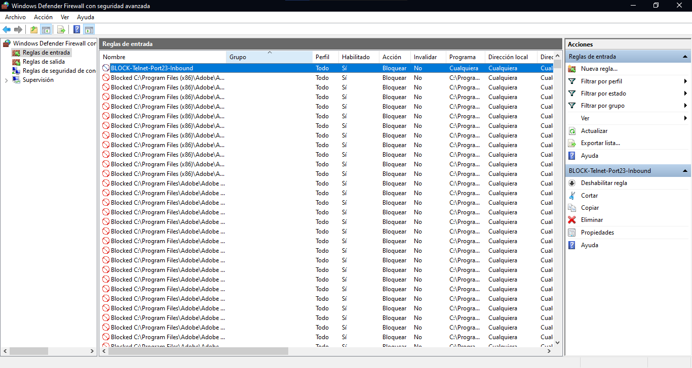
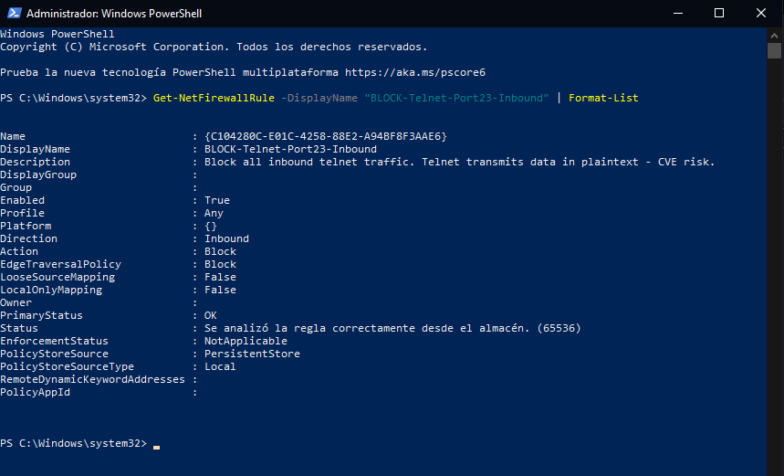
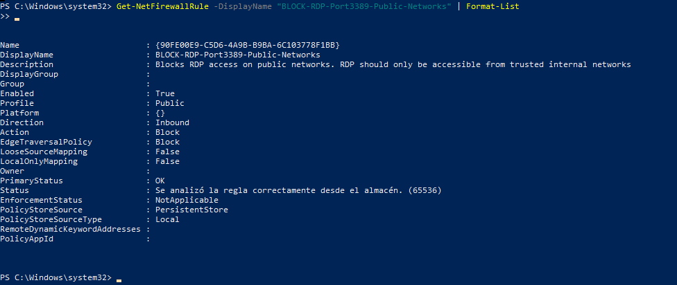
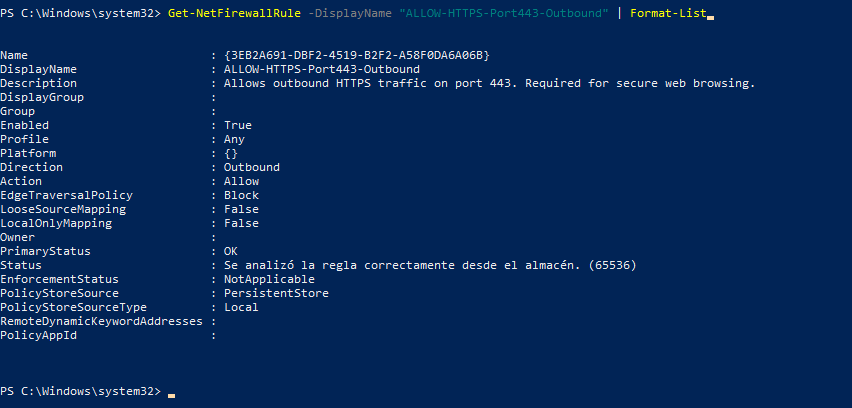

# Lab 05 — Firewall Rules & Access Control

## Objective
Configure and verify Windows Defender Firewall rules to control inbound
and outbound network traffic. Simulate real-world firewall hardening
scenarios commonly tested in CompTIA Security+ PBQ (Performance-Based
Questions) and applied daily in SOC and sysadmin roles.

## Security+ Objectives Covered
- 3.1 — Network security concepts (firewall rules, ACLs)
- 4.6 — Implementing secure protocols (blocking Telnet, allowing HTTPS)
- 4.3 — Network reconnaissance and discovery (port state verification)
- 1.2 — Threat vectors (RDP exploitation, Telnet plaintext exposure)

## Tools Used
- Windows Defender Firewall with Advanced Security (wf.msc)
- PowerShell (Administrator) — Get-NetFirewallRule, netsh advfirewall
- Nmap 7.99 — port state verification

## Rules Created

| Rule Name | Direction | Port | Protocol | Action | Profile |
|---|---|---|---|---|---|
| BLOCK-Telnet-Port23-Inbound | Inbound | 23 | TCP | Block | Any |
| BLOCK-RDP-Port3389-Public-Networks | Inbound | 3389 | TCP | Block | Public |
| ALLOW-HTTPS-Port443-Outbound | Outbound | 443 | TCP | Allow | Any |

## Steps Performed

### 1. Block Telnet (Port 23) — Inbound
Created an inbound rule to block all Telnet traffic on port 23.
Telnet transmits all data in plaintext including credentials — it
should never be allowed in any secure environment.

Verified with PowerShell:
Get-NetFirewallRule -DisplayName "BLOCK-Telnet-Port23-Inbound" | Format-List
Result: Enabled: True | Action: Block | Direction: Inbound

### 2. Block RDP on Public Networks (Port 3389) — Inbound
Created an inbound rule to block Remote Desktop Protocol on public
network profiles. RDP is one of the most commonly exploited attack
vectors — ransomware groups frequently use exposed RDP to gain
initial access.

Rule applies only to the Public profile — RDP remains accessible
on Private/Domain networks (internal trusted networks).

Verified with PowerShell:
Get-NetFirewallRule -DisplayName "BLOCK-RDP-Port3389-Public-Networks" | Format-List
Result: Enabled: True | Action: Block | Profile: Public

### 3. Allow HTTPS (Port 443) — Outbound
Created an outbound rule explicitly allowing HTTPS traffic.
Demonstrates the difference between implicit and explicit allow rules
in a firewall policy — a principle important for exam and real-world
implementation.

Verified with PowerShell:
Get-NetFirewallRule -DisplayName "ALLOW-HTTPS-Port443-Outbound" | Format-List
Result: Enabled: True | Action: Allow | Direction: Outbound

### 4. Export Firewall Configuration
Exported complete firewall configuration as evidence and backup:
netsh advfirewall export "firewall-rules-export.wfw"

## Screenshots

## Key Security Concepts Demonstrated

### Port States (Nmap)
| State | Meaning |
|---|---|
| open | Port accessible, service running |
| closed | Port reachable, no service listening |
| filtered | Firewall actively blocking the port |

### Rule Priority — Important for Exam
Windows Firewall processes rules in this order:
1. Explicit Block rules (highest priority)
2. Explicit Allow rules
3. Default policy (Block all inbound / Allow all outbound)

A Block rule always wins over an Allow rule at the same level.

### Why These Ports Matter
| Port | Service | Security Risk |
|---|---|---|
| 23 | Telnet | Plaintext transmission — credentials exposed |
| 3389 | RDP | Most exploited vector for ransomware initial access |
| 443 | HTTPS | Secure web — should always be allowed outbound |
| 22 | SSH | Secure alternative to Telnet |
| 80 | HTTP | Unencrypted — monitor or restrict |

## Security Relevance
In a SOC analyst role, firewall rules are reviewed during:
- **Incident response** — identifying if attacker traffic was blocked
- **Threat hunting** — looking for allowed traffic that should be blocked
- **Security audits** — verifying hardening standards (CIS Benchmarks)
- **Change management** — reviewing new rules before they go to production

A common SOC finding: RDP (port 3389) exposed to the internet with
no IP restrictions — this single misconfiguration has been the entry
point for major ransomware attacks including WannaCry and REvil.

## Note on Windows Firewall Loopback Behavior
Windows Defender Firewall does not filter loopback traffic (127.0.0.1).
Nmap scans against localhost will show `closed` even when a block rule
is active. This is expected behavior — rules apply to traffic entering
through real network interfaces (Wi-Fi, Ethernet), not internal loopback.
Verification was performed using Get-NetFirewallRule via PowerShell.

## Lessons Learned
- Block rules take priority over Allow rules in Windows Firewall
- PowerShell (Get-NetFirewallRule) provides reliable rule verification
  independent of loopback limitations
- RDP should never be exposed on public network profiles
- Telnet (port 23) must always be blocked — SSH (port 22) is the
  secure alternative
- Exporting firewall config (netsh advfirewall export) is standard
  practice for documentation and disaster recovery